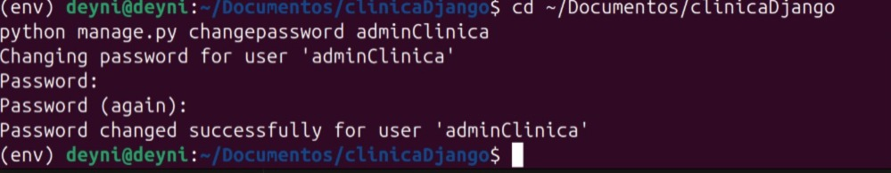
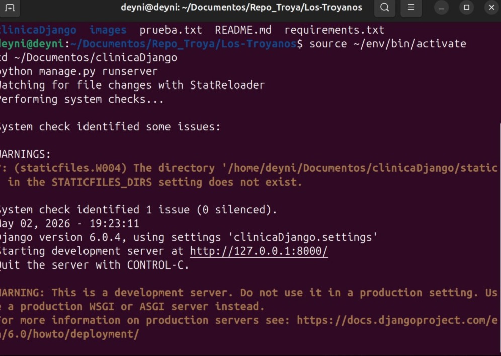
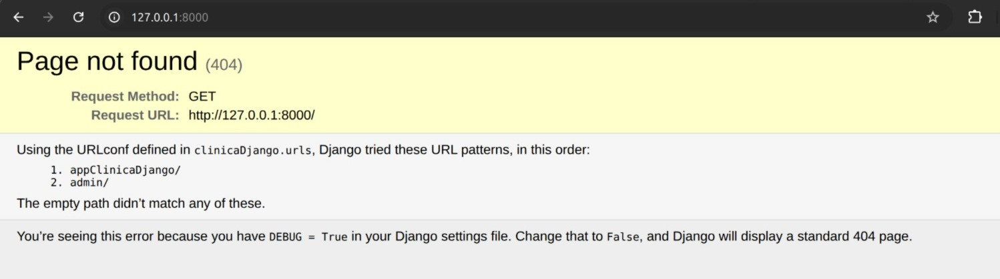
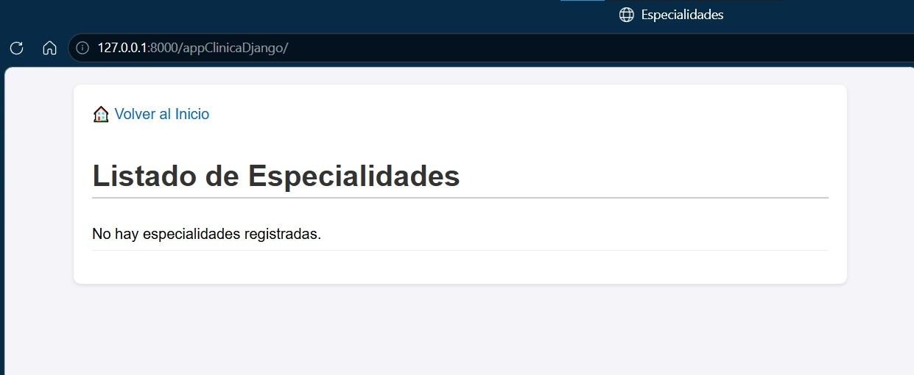
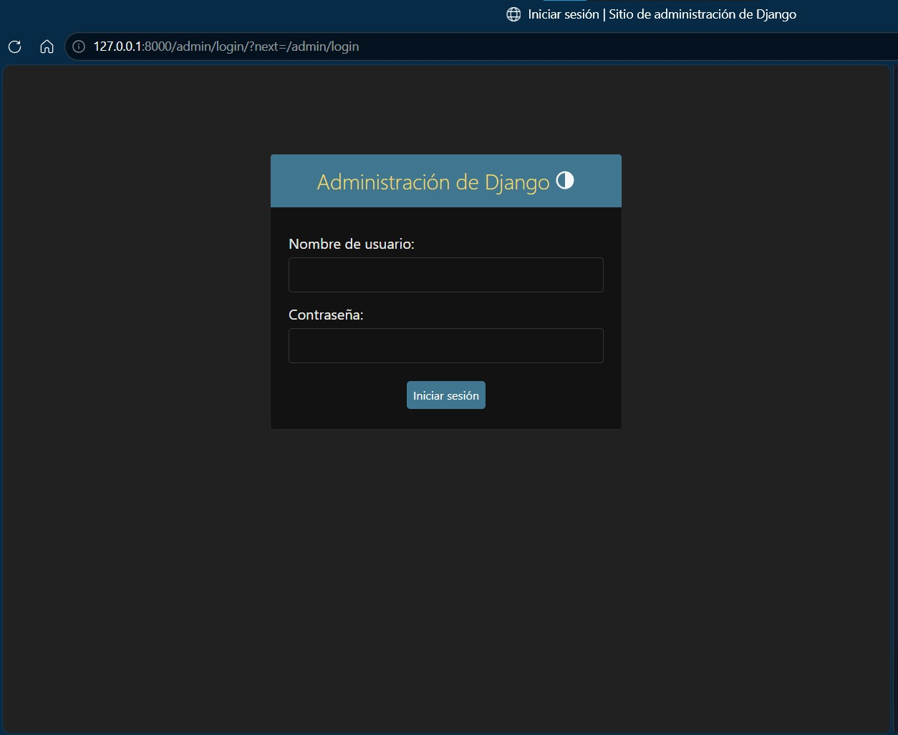
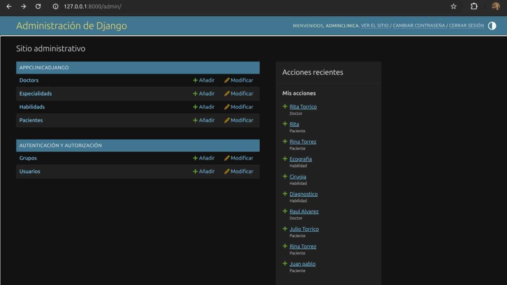
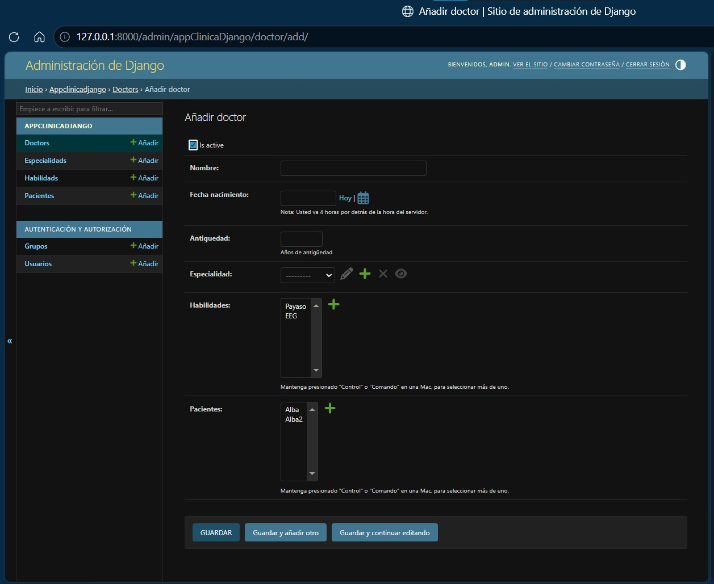

#  TROYANOS

<p align="center">
  
</p>

## Integrantes:


- Dana Sainz Rubin de Celis

  Cel: 74325363
  
  Gmail: paraactividadescurriculates.777@gmail.com


- Andre Fernando Villca Torrico

  Cel: 78267040
  
  Gmail: 202401363@est.umss.edu


- Jhosselin Sthaicy Bustamante Escobar

   Cel: 70775686

   Gmail: sthaicy08@gmail.com
   

- Jhonatan Alvarado Mamani

  Cel: 78304064
  
  Gmail: alvaj802@gmail.com


##  Plantilla: Sistema de Gestión Clínica (Django)
##  Clínica Django

Proyecto web desarrollado con Django para la gestión de una clínica médica.

## Requisitos
- Python 3.12
- Django 6.0

## Instalación
1. Activar entorno virtual: source env/bin/activate
2. Instalar dependencias: pip install -r requirements.txt
3. Ejecutar servidor: python manage.py runserver
5. Credenciales por defecto:
Para acceder al panel de administración:
- Usuario: `adminClinica`
- Contraseña: `adminClinica`

> Si necesitas cambiar la contraseña ejecuta:
> python manage.py changepassword adminClinica
4. Registrar  password:
```
cd ~/Documentos/clinicaDjango
python manage.py changepassword adminClinica
```


## Ejecución:
1. Una vez haya corrido el programa con este comando:
```
source ~/env/bin/activate
cd ~/Documentos/clinicaDjango
python manage.py runserver
```
tiene la posibilidad de entrar con el url subrayado en la terminal:
http://127.0.0.1:8000/. Una vez dentro tiene las opciones de ir a /admin/ o /appClinicaDjango/



2. El http lo rediccionará a una pagina donde le dará la opcion de añadir a 
ese http los sufijos (appClinicaDjango/) y (admin/).

 

3. En este contexto usted puede elegir
visitar la pagina donde se muestran los datos registrados por el admin.



4. Si elige el "admin/"deberá logearse con el usuario y password que haya registrado antes podrá ver la interfás del administrador donde usted es capas
añadir datos (doctores,habilidades,especialidades,pacientes y vincularlos a los doctores)







## Lógica del Negocio
Este sistema está diseñado para gestionar el flujo básico de una clínica médica o consultorio independiente. Contempla el registro de **Pacientes**, la gestión de **Doctores** (con sus respectivas especialidades/habilidades) y el control interno de operaciones. 

## Arquitectura
El proyecto adopta un enfoque **"Local-First"**. Está optimizado para ejecutarse en servidores locales (ej. una computadora estándar en la recepción de la clínica) utilizando **SQLite**. Esta decisión arquitectónica permite a las pequeñas y medianas empresas tener un sistema de gestión de inventario, ventas o pacientes rápido y privado, eliminando los costos recurrentes de bases de datos o *hosting* en la nube.

## Notas
En caso de no funcionar por error de migración o credenciales, dado que no subimos la DB entera, por motivos de seguridad. Usar los siguientes comandos en shell/bash:

```bash
# Para la migración de DB
python manage.py migrate
python manage.py runserver

# Para nuevas credenciales
python manage.py createsuperuser
python manage.py runserver
```
